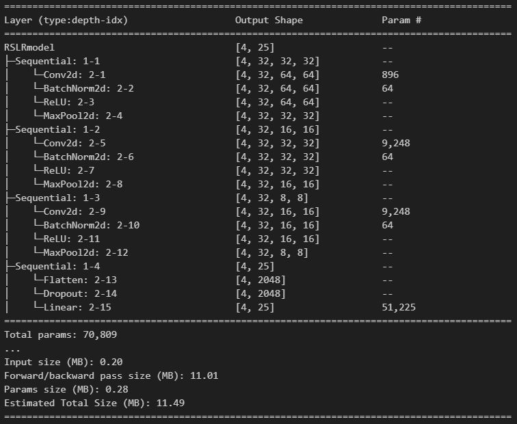
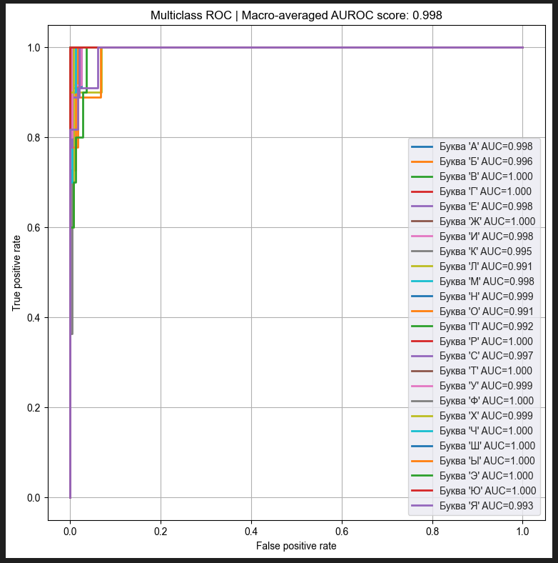
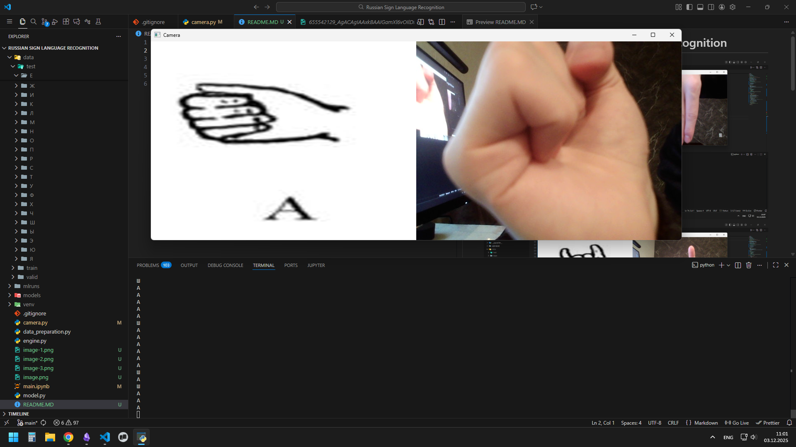
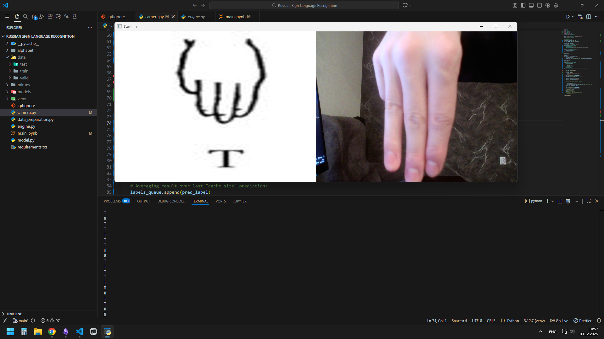
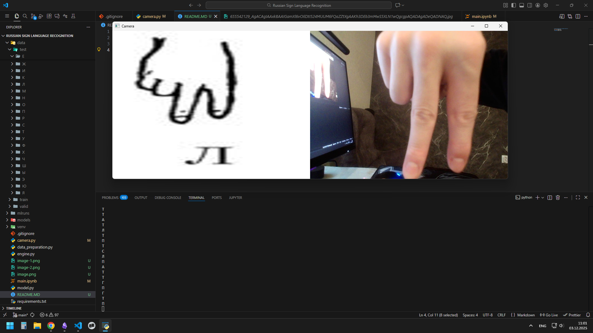
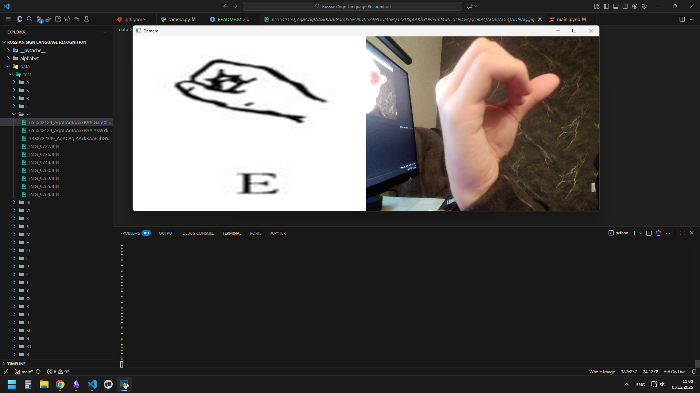
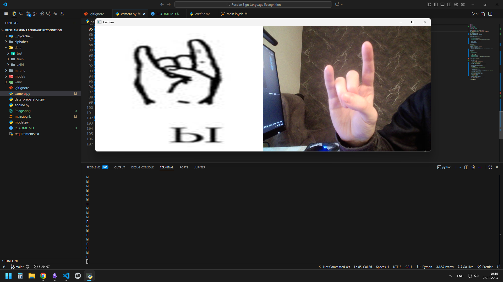

# Real-Time Russian Sign Language Recognition
Computer vision model for russian sign language recognition.
## Summary
 **Dataset:** https://www.kaggle.com/datasets/kamillakabardieva/russian-sign-language-alphabet
 **Model:** Basic CNN (70k parameters)

 **Results:** 99.8% AUROC, 90% accuracy on test data

 **Stack**: Python, PyTorch (Torchvision, Torchmetrics), OpenCV, MLFlow

## Examples

